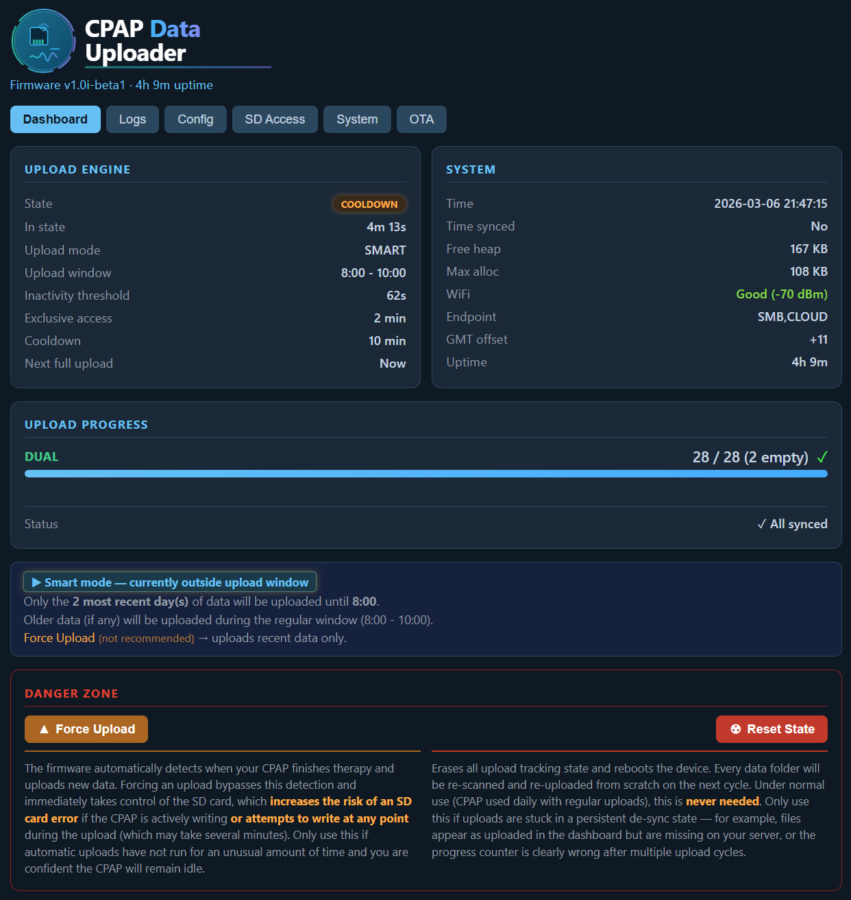

# ESP32 CPAP Data Uploader

Automatically upload CPAP therapy data from your SD card to network storage or the Cloud (SleepHQ).

**Supports:** ResMed Series 9, 10, and 11 CPAP machines

## Table of Contents
- [⚠️ Breaking Change in v0.8.0](#️-breaking-change-in-v080)
- [🚀 Quick Start](#-quick-start)
- [🚨 SD Card Errors? Use Scheduled Mode](#-sd-card-errors-use-scheduled-mode)
- [Features](#features)
- [Hardware Requirements](#hardware-requirements)
- [Getting Started (End Users)](#getting-started-end-users)
- [For Developers](#for-developers)
- [How It Works](#how-it-works)
- [Project Status](#project-status)
- [License](#license)

## ⚠️ Breaking Change in v0.8.0

**Configuration format has changed from JSON to Key-Value format.**

- Old: `config.json` (JSON format)
- New: `config.txt` (simple Key-Value format, one setting per line)

**If upgrading from v0.7.x or earlier:**
1. Your existing `config.json` will **NOT** work with v0.8.0
2. Create a new `config.txt` file using the Key-Value format (see examples in `docs/config.txt.example*`)
3. Read the [Configuration Guide](release/README.md#2-create-configtxt) for syntax and examples
4. **No backward compatibility** - you must convert your configuration manually

**Why this change?** The new format is more user-friendly, removes the ArduinoJson dependency, and reduces memory usage.

---

## 🚀 Quick Start

**Want to use this?** Get started in 3 simple steps:

### 1. Get the Hardware
You need: [SD WIFI PRO](https://www.fysetc.com/products/fysetc-upgrade-sd-wifi-pro-with-card-reader-module-run-wireless-by-esp32-chip-web-server-reader-uploader-3d-printer-parts) adapter
- ESP32-PICO-D4 microcontroller, 4MB Flash, WiFi 2.4GHz

### 2. Download & Flash Firmware
👉 **[Download Latest Release](../../releases)** (includes firmware + upload tools for Windows/Mac/Linux)

Follow the included instructions to flash firmware to your SD WIFI PRO.

### 3. Create Simple Config
Create `config.txt` on your SD card with just **6-10 lines**:

**👇👇👇 Click the option you want to use** (or click ▸ to expand additional options):

---

<details>
<summary><b>📤 Network Share (SMB)</b></summary>

```ini
WIFI_SSID = YourWiFiName
WIFI_PASSWORD = YourWiFiPassword
ENDPOINT_TYPE = SMB
ENDPOINT = //192.168.1.100/cpap_backups
ENDPOINT_USER = username
ENDPOINT_PASSWORD = password
```
</details>

<details>
<summary><b>☁️ SleepHQ Cloud</b></summary>

```ini
WIFI_SSID = YourWiFiName
WIFI_PASSWORD = YourWiFiPassword
ENDPOINT_TYPE = CLOUD
CLOUD_CLIENT_ID = your-client-id
CLOUD_CLIENT_SECRET = your-client-secret
```
</details>

<details>
<summary><b>🔄 Both SMB + SleepHQ (Dual Upload)</b></summary>

```ini
WIFI_SSID = YourWiFiName
WIFI_PASSWORD = YourWiFiPassword
ENDPOINT_TYPE = SMB,CLOUD
ENDPOINT = //192.168.1.100/cpap_backups
ENDPOINT_USER = username
ENDPOINT_PASSWORD = password
CLOUD_CLIENT_ID = your-client-id
CLOUD_CLIENT_SECRET = your-client-secret
```
</details>

---

**That's it!** Insert the SD card in your CPAP machine and you're done. Everything else has smart defaults.

---

## 🚨 SD Card Errors? Use Scheduled Mode

> **If your CPAP machine shows an "SD Card Error" or "SD Card Removed" message, add these lines to your `config.txt` immediately:**

```ini
UPLOAD_MODE = scheduled
UPLOAD_START_HOUR = 9
UPLOAD_END_HOUR = 23
```

The default `smart` mode uses SD bus activity detection to determine when it is safe to take the card. On some CPAP models this detection may not work reliably, causing the uploader to take the card at the wrong moment. **Scheduled mode avoids this entirely** — it only uploads during the window you configure (e.g. while you're awake), never during sleep.

> Set `UPLOAD_START_HOUR` / `UPLOAD_END_HOUR` to hours when you are typically awake and not using the CPAP. See the [full guide](release/README.md#️-sd-card-errors--use-scheduled-mode) for details.

---

**💻 Web Interface:** Once running, access the dashboard at **`http://cpap.local`** to monitor uploads, view logs, and manage settings.

📖 **Need more details?** See the comprehensive [User Guide](release/README.md)

### Web Interface

Access the dashboard at `http://cpap.local` to monitor your upload progress:



**Features:**
- Real-time upload status and progress
- System information (WiFi, time sync, memory)
- Manual upload trigger
- SD Activity Monitor
- View logs and configuration
- OTA firmware updates

---

## Features
- Automatic uploads to Windows shares, NAS, Samba servers or the Cloud (**SleepHQ**)
- **"Smart" upload mode** (uploads for recent data start automatically within minutes of therapy end)
  - <u>Automatic detection of CPAP therapy session ending</u> (based on SD card activity)
  - **You get your last night of sleep data within a few minutes after taking your mask off**
- Scheduled upload mode: predictable upload window with timezone support
- **Progressive Web App interface** with pre-allocated buffers (prevents heap fragmentation)
- **Automatic heap recovery** with seamless soft-reboots when memory fragmented
- **Pre-flight scans** - only authenticates when files need uploading
- **Over-The-Air (OTA) firmware updates** via web interface
- **Local Network Discovery (mDNS)**: Access the device via `http://cpap.local` (configurable hostname)
- Secure credential storage in ESP32 flash memory (optional)
- Respects CPAP machine access to SD card (only "holds" the SD card for the bare minimum required time)
  - Quick file uploads with TLS connection reuse and exclusive file access (no time budget sharing with CPAP machine)
- Tracks uploaded files (no duplicates)
- Smart empty folder handling (waits 7 days before marking folders complete)
- <u>Web interface</u> for monitoring and testing (responsive, runs as a separate task on another core)
- Automatic retry mechanism with progress tracking
- Automatic directory creation on remote shares for SMB protocol

---

## Hardware Requirements

**Required Hardware:**
- [SD WIFI PRO](https://www.fysetc.com/products/fysetc-upgrade-sd-wifi-pro-with-card-reader-module-run-wireless-by-esp32-chip-web-server-reader-uploader-3d-printer-parts) adapter (ESP32-PICO-D4, 4MB Flash, WiFi 2.4GHz)
- SD WIFI PRO development board (for initial firmware flashing via USB)

**Supported CPAP Machines:**
- ✅ ResMed **Series 9** (S9 AutoSet, Lumis)
- ✅ ResMed **Series 10** (AirSense, AirCurve)  
- ✅ ResMed **Series 11** (Elite, AutoSet)
- ❌ Other brands/models not currently supported

**Network Requirements:**
- 2.4GHz WiFi network (ESP32 doesn't support 5GHz)
- SMB/CIFS share OR SleepHQ account

---

## Getting Started (End Users)

**👉 [Download Latest Release](../../releases)** - Includes precompiled firmware and upload tools

**📖 [Complete User Guide](release/README.md)** - Detailed setup, configuration, and troubleshooting

**📁 [Config Examples](docs/)** - See `config.txt.example*` files for different setups

## For Developers

**Want to build, modify, or contribute?**

📘 **[Development Guide](docs/DEVELOPMENT.md)** - Complete developer documentation:
- Architecture & design decisions
- Build instructions (PlatformIO)
- libsmb2 integration
- Testing procedures  
- Contributing guidelines

**Quick Build:**
```bash
# Clone with submodules
git clone --recurse-submodules https://github.com/yourusername/CPAP_data_uploader

# Or if already cloned
git submodule update --init --recursive

# Build (libsmb2 automatically configured)
pio run -e pico32         # Standard build (3MB app space, no OTA)
pio run -e pico32-ota     # OTA build (1.5MB app space, web updates)
```

**Additional Documentation:**
- [Architecture](docs/02-ARCHITECTURE.md)
- [Requirements](docs/03-REQUIREMENTS.md)
- [Build Troubleshooting](docs/BUILD_TROUBLESHOOTING.md)
- [Feature Flags](docs/FEATURE_FLAGS.md)

## How It Works

1. **Device reads configuration** from `config.txt` on SD card
2. **Connects to WiFi** and synchronizes time with internet
3. **Waits for upload eligibility based on mode**
   - **Smart mode:** starts shortly after therapy ends (activity detection)
   - **Scheduled mode:** uploads during configured window
4. **Pre-flight scan** checks if files need uploading (skips authentication if nothing new)
5. **Uploads required CPAP data** in stages (SMB first, then Cloud) to optimize memory
   - Takes exclusive control of SD card (default 5 minutes). **Only accesses the card when NOT in use** by the CPAP machine (no therapy running, automatic detection)
   - Uploads `DATALOG/` folders and `SETTINGS/` files
   - Uploads root files **if present**: `STR.edf`, `Identification.crc`, `Identification.tgt` (ResMed 9/10), `Identification.json` (ResMed 11)
   - Tracks what's been uploaded (no duplicates)
   - Releases SD card for CPAP machine use
6. **Automatic heap recovery** reboots if memory becomes fragmented (seamless, fast-boot)
7. **Repeats** automatically (periodically, daily if in "scheduled" mode)

The device respects your CPAP machine's need for SD card access by only accessing the card when it's not used by CPAP, keeping upload sessions short and releasing control immediately after each session.


## Project Status

**Current Version:** see "Releases" section for version information

**Status:** ✅ Production Ready + Power Management
- Hardware tested and validated
- Integration tested with real CPAP data
- All unit tests passing
- SMB/CIFS and Cloud upload (SleepHQ) fully implemented
- Web interface remains responsive during uploads, runs on a separate task/different core
- Automatic retry mechanism with progress tracking
- Automatic directory creation verified and working (SMB)
- FreeRTOS tasks for true concurrent web server operation during uploads
- Configurable power management for reduced current consumption

**Supported Upload Methods:**
- ✅ SMB/CIFS (Windows shares, NAS, Samba)
- ✅ SleepHQ direct upload
- ⏳ WebDAV (planned)

## Future Improvements
- Add WebDAV upload support

## Support & Documentation

- **User Guide:** [release/README.md](release/README.md) - Setup and usage instructions
- **Developer Guide:** [docs/DEVELOPMENT.md](docs/DEVELOPMENT.md) - Build and contribute
- **Troubleshooting:** See user guide or developer guide
- **Issues:** Report bugs or request features via GitHub issues

## License

This project is licensed under the **GNU General Public License v3.0 (GPL-3.0)**.

**What this means:**
- ✅ You can use this software for free
- ✅ You can modify the source code
- ✅ You can distribute modified versions
- ⚠️ **Any distributed versions (modified or not) must remain free and open source**
- ⚠️ Modified versions must also be licensed under GPL-3.0

This project uses libsmb2 (LGPL-2.1), which is compatible with GPL-3.0.

See [LICENSE](LICENSE) file for full terms.

## Legal & Trademarks

- **SleepHQ** is a trademark of its respective owner. This project is an unofficial client and is not affiliated with, endorsed by, or associated with SleepHQ.
  - This project uses the officially published [SleepHQ API](https://sleephq.com/api-docs) and does not rely on any non-official methods.
  - This project is **not intended to compete** with the official [Magic Uploader](https://shop.sleephq.com/products/magic-uploader-pro). We strongly encourage users to support the platform by purchasing the official solution, which comes with vendor support and requires no technical setup (flashing).
- **ResMed** is a trademark of ResMed. This software is not affiliated with ResMed.
- All other trademarks are the property of their respective owners.

### Disclaimer & No Warranty

**USE AT YOUR OWN RISK.**

This project (including source code, pre-compiled binaries, and documentation) is provided "as is" and **without any warranty of any kind**, express or implied.

**By using this software, you acknowledge and agree that:**
1.  **You are solely responsible** for the safety and operation of your CPAP machine and data.
2.  The authors and contributors **guarantee nothing** regarding the reliability, safety, or suitability of this software.
3.  **We are not liable** for any damage to your CPAP machine, SD card, loss of therapy data, or any other direct or indirect damage resulting from the use of this project.
4.  **Warranty Implication:** Using third-party accessories or software with your medical device may void its warranty. You accept this risk entirely.

This software interacts directly with medical device hardware and file systems. While every effort has been made to ensure safety, bugs or hardware incompatibilities can occur.

**GPL-3.0 License Disclaimer:**
> THERE IS NO WARRANTY FOR THE PROGRAM, TO THE EXTENT PERMITTED BY APPLICABLE LAW. EXCEPT WHEN OTHERWISE STATED IN WRITING THE COPYRIGHT HOLDERS AND/OR OTHER PARTIES PROVIDE THE PROGRAM "AS IS" WITHOUT WARRANTY OF ANY KIND, EITHER EXPRESSED OR IMPLIED, INCLUDING, BUT NOT LIMITED TO, THE IMPLIED WARRANTIES OF MERCHANTABILITY AND FITNESS FOR A PARTICULAR PURPOSE. THE ENTIRE RISK AS TO THE QUALITY AND PERFORMANCE OF THE PROGRAM IS WITH YOU. SHOULD THE PROGRAM PROVE DEFECTIVE, YOU ASSUME THE COST OF ALL NECESSARY SERVICING, REPAIR OR CORRECTION.

See the [LICENSE](LICENSE) file for the full legal text.

---

**Made for CPAP users who want automatic, reliable data backups.**

