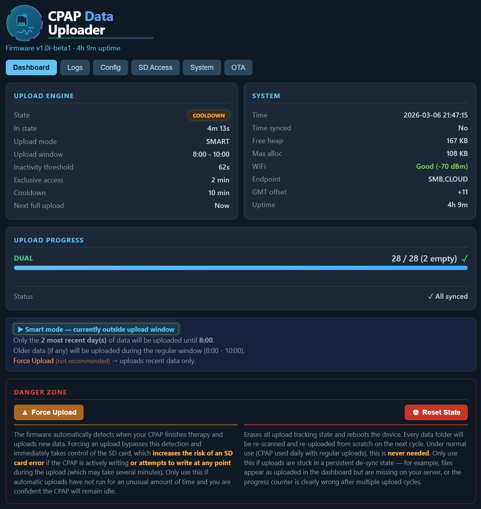

# ESP32 CPAP AutoSync

Automatically upload CPAP therapy data from your SD card to a network share or SleepHQ — **within minutes of taking your mask off.**

* **Supports:** ResMed Series 9, 10, and 11
* **Hardware:** [SD WIFI PRO](https://www.fysetc.com/products/fysetc-upgrade-sd-wifi-pro-with-card-reader-module-run-wireless-by-esp32-chip-web-server-reader-uploader-3d-printer-parts) — an ESP32-powered SD card that physically inserts into your CPAP's SD card slot like a regular memory card

---

## ⚠️ **IMPORTANT COMPATIBILITY NOTICE**

### **AirSense 11 Power Compatibility**
Some **Singapore-made AirSense 11 machines** may not provide sufficient power to the SD card adapter, which can cause spontaneous reboots or WiFi connection failures:

- **Potentially affected models:**
  - Platform: `R390-447/1`
  - REF: `39517`
  - Modem (WMOD / FCC ID): `AIR11M1G22`
- **How to check:** Look at the label on the back/bottom of your AirSense 11 device. The platform code (e.g. R390-...) is usually near the "Made in XXX" text.
- **Status:** If your machine matches these specific codes, you may experience power issues. Adjusting firmware power settings (`WIFI_TX_PWR`, `WIFI_PWR_SAVING`, `BROWNOUT_DETECT`, `ENABLE_1BIT_SD_MODE`) can help, but may still not be enough to fully resolve the hardware limitation on this specific variant (will likely require hardware modification).

**👇 Click to expand:**

<details>
<summary><b>🔍 How to tell if your CPAP has power issues</b></summary>

> **⚠️ Identifying Power Issues**
>
> If your CPAP cannot provide enough power to the SD card, the ESP32 chip will reset itself. You might notice:
> - The device disappears from WiFi frequently
> - Uploads fail midway or never start
> - The web interface is unreliable
>
> You can confirm this is happening by looking at your logs:
> 1. If `PERSISTENT_LOGS=true` is set, check the downloaded logs from the web interface.
> 2. If the device cannot even stay online long enough to broadcast WiFi, pull the SD card and look for a file called `uploader_error.txt`.
>
> Look for this specific warning:
> ```text
> [INFO] Reset reason: Brown-out reset (low voltage)
> [ERROR] WARNING: System reset due to brown-out (insufficient power supply), this could be caused by:
> [ERROR]  - the CPAP was disconnected from the power supply
> [ERROR]  - the card was removed
> [ERROR]  - the CPAP machine cannot provide enough power
> ```

</details>

### **Confirmed Working**
- ✅ **All AirSense 10 models**
- ✅ **Australian-made AirSense 11 models**
- ✅ **Some Singapore-made AirSense 11 models**
  - For example, machines with REF `39523` with modem `AIR11M1U` have been stable since v1.0i-beta1

> **Versions between v0.11.0 and v1.0i:** Added progressively more aggressive power optimizations (reduced TX power, 802.11b disabled, Bluetooth disabled, CPU throttled, WiFi modem-sleep enabled) specifically to improve AirSense 11 compatibility, which allowed some previously incompatible models to work.

**If you have a Singapore-made AirSense 11 with REF** `39517` **and modem** `AIR11M1G22`, **please check your device label and report your experience to help us gather more compatibility data.**

---



---

## 🚀 Quick Start — 4 Steps

### 1. Get the hardware
[SD WIFI PRO](https://www.fysetc.com/products/fysetc-upgrade-sd-wifi-pro-with-card-reader-module-run-wireless-by-esp32-chip-web-server-reader-uploader-3d-printer-parts) — an ESP32-powered SD card that physically inserts into your CPAP's SD card slot like a regular memory card.

### 2. Flash the firmware
👉 **[Download Latest Release](../../releases)** — includes firmware binaries and upload scripts for Windows, Mac, and Linux. Follow the included instructions.

### 3. Create `config.txt` on the SD card
Just WiFi credentials and upload destination — **6 to 10 lines total**.

**👇 Click your upload destination:**

<details>
<summary><b>📤 Network Share (SMB — Windows, NAS, Samba)</b></summary>

```ini
WIFI_SSID = YourWiFiName
WIFI_PASSWORD = YourWiFiPassword
ENDPOINT_TYPE = SMB
ENDPOINT = //192.168.1.100/cpap_backups
ENDPOINT_USER = username
ENDPOINT_PASSWORD = password
```
</details>

<details>
<summary><b>☁️ SleepHQ Cloud</b></summary>

```ini
WIFI_SSID = YourWiFiName
WIFI_PASSWORD = YourWiFiPassword
ENDPOINT_TYPE = CLOUD
CLOUD_CLIENT_ID = your-client-id
CLOUD_CLIENT_SECRET = your-client-secret
```
</details>

<details>
<summary><b>🔄 Both (SMB + SleepHQ simultaneously)</b></summary>

```ini
WIFI_SSID = YourWiFiName
WIFI_PASSWORD = YourWiFiPassword
ENDPOINT_TYPE = SMB,CLOUD
ENDPOINT = //192.168.1.100/cpap_backups
ENDPOINT_USER = username
ENDPOINT_PASSWORD = password
CLOUD_CLIENT_ID = your-client-id
CLOUD_CLIENT_SECRET = your-client-secret
```
</details>

### 4. Insert card and open `http://cpap.local`

That's it. The device connects to WiFi, waits for your therapy session to end, and uploads automatically.

Open **[http://cpap.local](http://cpap.local)** in your browser to see live upload status, view logs, and manage settings. *(Note: `cpap.local` only resolves for the first 60 seconds after boot to save power — accessing it within this window redirects you to the device's IP address.)*

> **From here on, you can edit your config directly in the browser** — Config tab → Edit. No need to pull the SD card again.

---

## 🚨 Seeing an SD Card Error on your CPAP?

SD card errors typically happen for two reasons:
1. **Power Limits:** The CPAP machine cannot provide enough peak current to the SD slot during WiFi uploads. (Ensure you are running the latest firmware, which includes aggressive power-saving features).
2. **Bad Timing (Collisions):** In **smart** mode, uploads begin shortly after therapy ends. If you briefly pause therapy and then resume it while an upload is actively running, the CPAP and the WiFi SD card will clash over SD access.

If bad timing is causing your errors, you can avoid it entirely by switching to **scheduled** mode in `config.txt`, setting a window during your waking hours:

```ini
UPLOAD_MODE = scheduled
UPLOAD_START_HOUR = 9
UPLOAD_END_HOUR = 21
```

See the [Full Setup Guide](release/README.md#️-sd-card-errors--use-scheduled-mode) for details.

---

## What You Get

- **Automatic uploads after every therapy session** — smart mode detects when your CPAP finishes and starts uploading within minutes
- **Uploads to Windows shares, NAS, or SleepHQ** — or both at the same time
- **Web dashboard at `http://cpap.local`** — live progress, logs, config editor, OTA updates *(available for first 60 seconds after boot, then use IP address)*
- **Edit config from the browser** — no SD card pulls after initial setup
- **Never uploads the same file twice** — tracks what's been sent, even across reboots
- **Persistent log storage** — enable `PERSISTENT_LOGS=true` to flush logs to internal flash every 30 seconds; download past sessions from the browser. Emergency logs are always saved to SD card on boot failures and to internal flash before every reboot.
- **Live system diagnostics** — System tab tracks free heap, max contiguous allocation (with rolling 2-minute minimums), and CPU load graphs for both cores
- **Respects your CPAP machine** — only accesses the SD card when therapy is not running

---

## Hardware

| | |
|---|---|
| **Adapter** | [SD WIFI PRO](https://www.fysetc.com/products/fysetc-upgrade-sd-wifi-pro-with-card-reader-module-run-wireless-by-esp32-chip-web-server-reader-uploader-3d-printer-parts) (ESP32-PICO-D4, 4MB Flash, WiFi 2.4GHz) |
| **CPAP machines** | ResMed Series 9, 10, and 11 |
| **WiFi** | 2.4GHz only (ESP32 limitation) |
| **Upload targets** | SMB/CIFS share, SleepHQ cloud, or both |

---

## Documentation

📖 **[Full Setup Guide](release/README.md)** — firmware flashing, all config options, troubleshooting, web interface reference

🔧 **[Developer Guide](docs/DEVELOPMENT.md)** — build from source, architecture, contributing

---

## License

This project is licensed under the **GNU General Public License v3.0 (GPL-3.0)**.

**What this means:**
- ✅ You can use this software for free
- ✅ You can modify the source code
- ✅ You can distribute modified versions
- ⚠️ **Any distributed versions (modified or not) must remain free and open source**
- ⚠️ Modified versions must also be licensed under GPL-3.0

This project uses libsmb2 (LGPL-2.1), which is compatible with GPL-3.0.

See [LICENSE](LICENSE) file for full terms.

## Acknowledgements

This project was originally inspired by and started as a fork of the excellent [CPAP Data Uploader](https://github.com/amanuense/CPAP_data_uploader) project by Oscar Arias (amanuense). The initial goal of the fork was simply to add SleepHQ support, but it quickly grew into a fully distinct project with its own architecture, web dashboard, smart power management, and upload engine. We are deeply grateful to Oscar for proving the viability of the FYSETC SD WIFI PRO hardware and for creating the foundation that made this project possible.

---

## Legal & Trademarks

- **SleepHQ** is a trademark of its respective owner. This project is an unofficial client and is not affiliated with, endorsed by, or associated with SleepHQ.
  - This project uses the officially published [SleepHQ API](https://sleephq.com/api-docs) and does not rely on any non-official methods.
  - This project is **not intended to compete** with the official [Magic Uploader](https://shop.sleephq.com/products/magic-uploader-pro). We strongly encourage users to support the platform by purchasing the official solution, which comes with vendor support and requires no technical setup (flashing).
- **ResMed** is a trademark of ResMed. This software is not affiliated with ResMed.
- All other trademarks are the property of their respective owners.

### Disclaimer & No Warranty

**USE AT YOUR OWN RISK.**

This project (including source code, pre-compiled binaries, and documentation) is provided "as is" and **without any warranty of any kind**, express or implied.

**By using this software, you acknowledge and agree that:**
1.  **You are solely responsible** for the safety and operation of your CPAP machine and data.
2.  The authors and contributors **guarantee nothing** regarding the reliability, safety, or suitability of this software.
3.  **We are not liable** for any damage to your CPAP machine, SD card, loss of therapy data, or any other direct or indirect damage resulting from the use of this project.
4.  **Warranty Implication:** Using third-party accessories or software with your medical device may void its warranty. You accept this risk entirely.

This software interacts directly with medical device hardware and file systems. While every effort has been made to ensure safety, bugs or hardware incompatibilities can occur.

**GPL-3.0 License Disclaimer:**
> THERE IS NO WARRANTY FOR THE PROGRAM, TO THE EXTENT PERMITTED BY APPLICABLE LAW. EXCEPT WHEN OTHERWISE STATED IN WRITING THE COPYRIGHT HOLDERS AND/OR OTHER PARTIES PROVIDE THE PROGRAM "AS IS" WITHOUT WARRANTY OF ANY KIND, EITHER EXPRESSED OR IMPLIED, INCLUDING, BUT NOT LIMITED TO, THE IMPLIED WARRANTIES OF MERCHANTABILITY AND FITNESS FOR A PARTICULAR PURPOSE. THE ENTIRE RISK AS TO THE QUALITY AND PERFORMANCE OF THE PROGRAM IS WITH YOU. SHOULD THE PROGRAM PROVE DEFECTIVE, YOU ASSUME THE COST OF ALL NECESSARY SERVICING, REPAIR OR CORRECTION.

See the [LICENSE](LICENSE) file for the full legal text.

---

**Made for CPAP users who want automatic, reliable data backups.**

